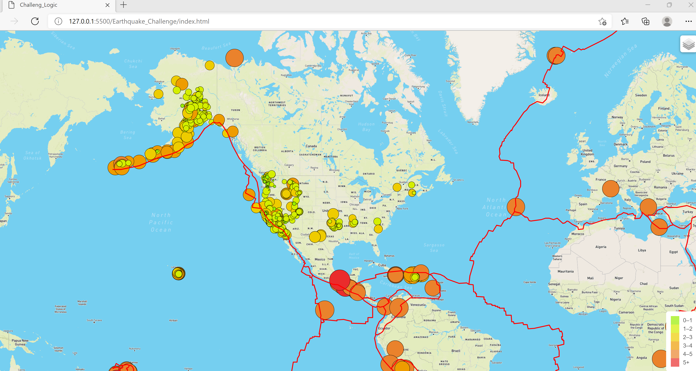
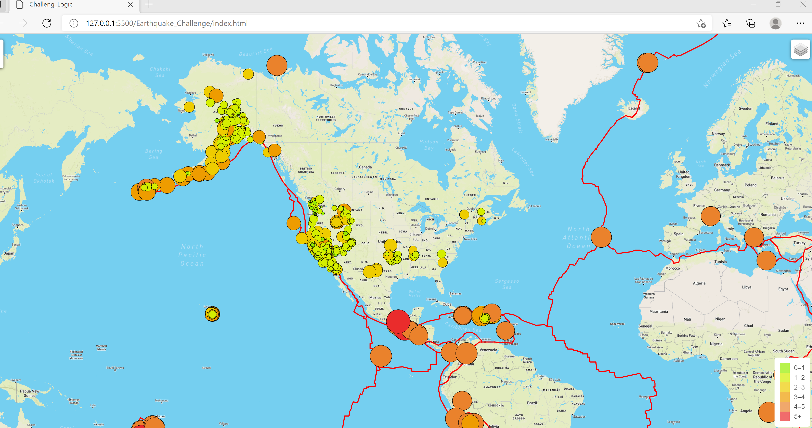
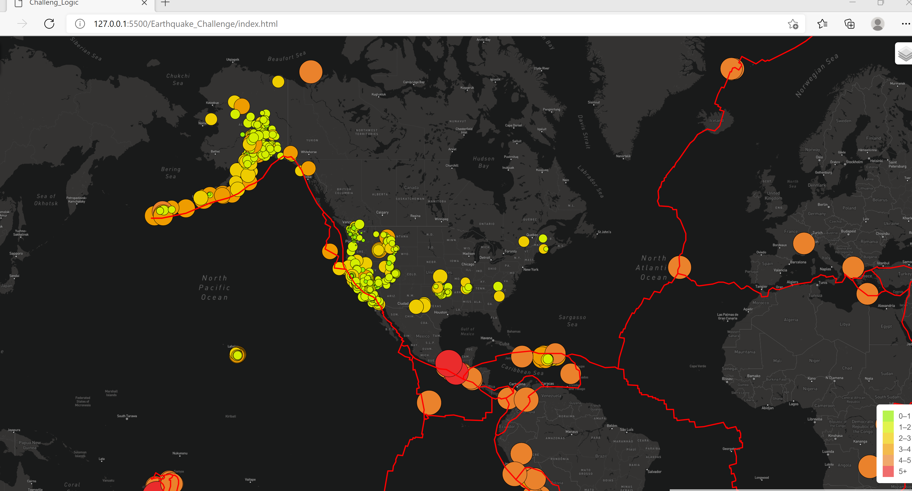

# Mapping_Earthquakes By David Matheny, Date 3/12/2022

# Background
Basil and Sadhana like how you created your earthquake map with two different maps and the earthquake overlay. Now, Basil and Sadhana would like to see the earthquake data in relation to the tectonic plates’ location on the earth, and they would like to see all the earthquakes with a magnitude greater than 4.5 on the map, and they would like to see the data on a third map.

# Deliverable 1 (see pic below)

# Deliverable 2 (see pic below)

# Deliverable 3 (see pic below)
